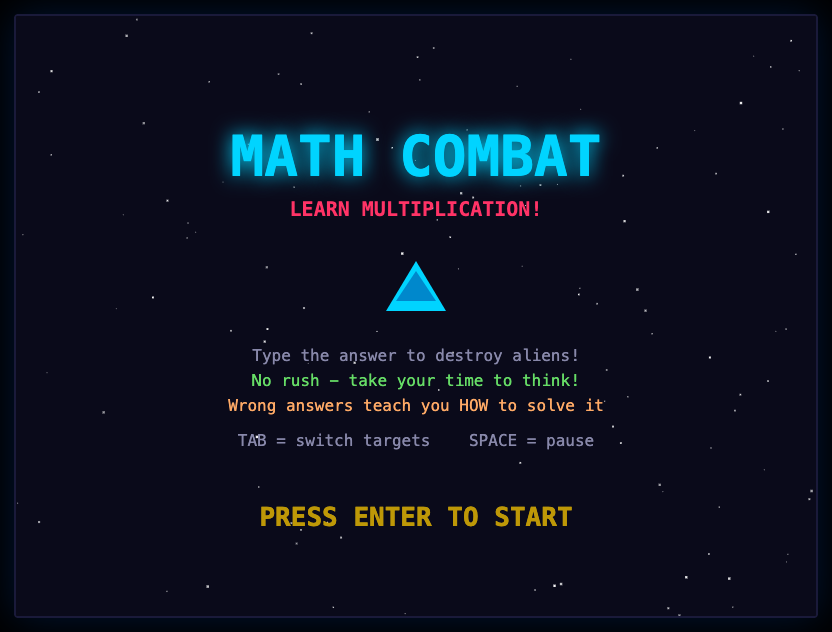
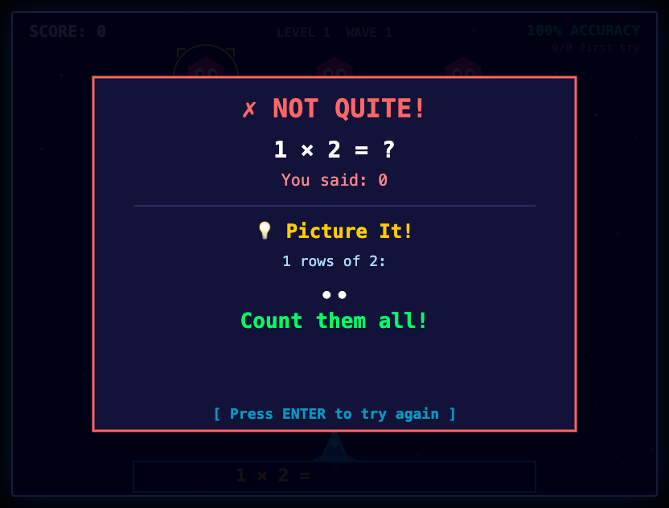
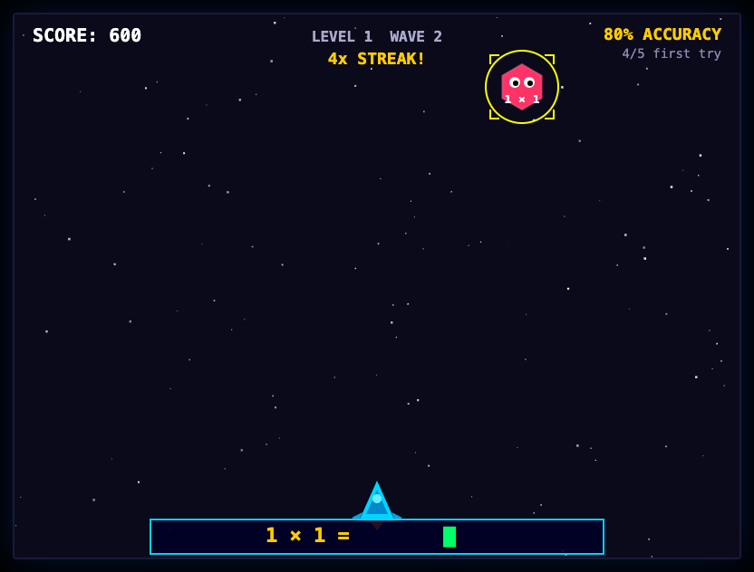
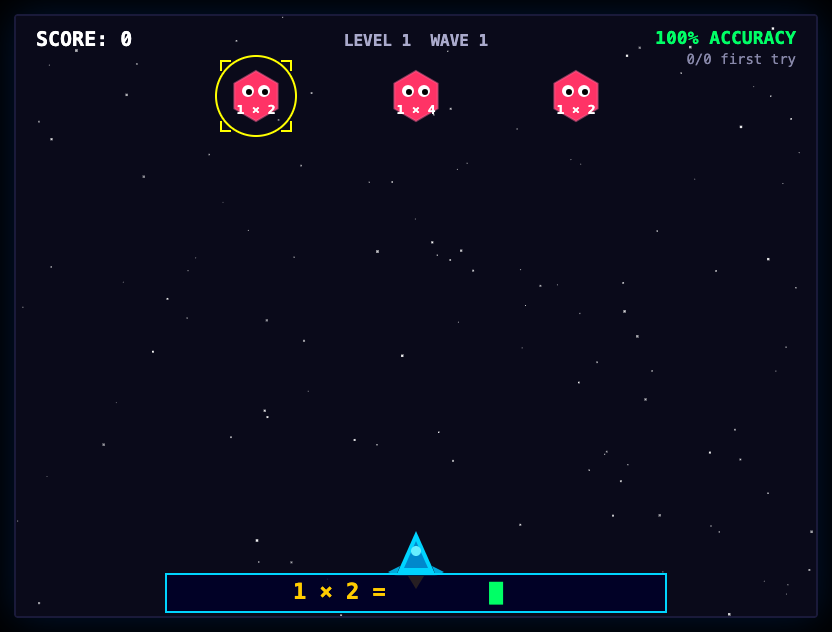

# MATH COMBAT

**Galaga meets flash cards.** A retro space shooter where you blast aliens out of the sky by solving multiplication and division problems. Built for kids, fun for everyone.

> Type the answer. Fire the laser. Watch them explode.



---

## What Is This?

Aliens are descending from space, and each one carries a math problem. Your only weapon? **Your brain.** Type the correct answer to fire a laser beam and obliterate them in a shower of particles. Chain correct answers together for combo streaks, screen shake, and satisfying sound effects.

Math Combat is a **learning-first** game designed for kids (built for a 7-year-old!) that makes practicing multiplication and division feel like playing an arcade game, not doing homework.

## Features

**Learning Mode** — No time pressure. Enemies don't move. Take your time, think it through. Accuracy matters more than speed.

**Teaching, Not Punishing** — Get an answer wrong? The game doesn't just say "WRONG." It shows you *how* to solve the problem with techniques like skip counting, breaking numbers apart, using tens, and visual arrays. Then you try again.



**11 Levels of Progression** — Starts with easy 1s and 2s, builds through the tricky 6s, 7s, 8s, and 9s, then introduces division and mixed operations. Difficulty ramps gradually so confidence builds with skill.

**Combo System** — Nail 3 in a row: *AWESOME!* Hit 5: *UNSTOPPABLE!* Reach 10: *MATH WIZARD!* Combos boost your score and the sound effects pitch up as you climb.



**Full Sound Design** — Laser pews, explosions, wrong-answer buzzes, combo chimes, level-complete fanfares — all synthesized in real-time with the Web Audio API. Zero audio files needed.

**Retro Arcade Feel** — Scrolling starfield, hexagonal alien enemies with googly eyes, a glowing ship with flickering engine flames, particle explosions, and screen shake that scales with your combo.

## How to Play

1. Open `index.html` in any modern browser
2. Press **Enter** to start
3. Type the answer to the targeted enemy's math problem
4. Press **Enter** to fire (single-digit answers auto-fire!)
5. Press **Tab** to switch targets
6. Press **Space** to pause

That's it. No installs. No dependencies. No build step.



## Controls

| Key | Action |
|-----|--------|
| `0-9` | Type your answer |
| `Enter` | Submit answer / Start game |
| `Backspace` | Delete last digit |
| `Tab` | Cycle to next enemy |
| `Space` | Pause / Unpause |

## Difficulty Levels

| Level | What You'll Practice | Details |
|-------|---------------------|---------|
| 1 | 1s and 2s | Warm-up — build confidence |
| 2 | 2s and 5s | Easy patterns |
| 3 | 2s, 5s, 10s | Numbers kids already know |
| 4 | 3s and 4s | New challenge |
| 5 | 2s through 5s | Full review mix |
| 6 | 6s and 7s | The tricky ones! |
| 7 | 7s, 8s, 9s | The hardest tables |
| 8 | Full multiplication | Everything combined |
| 9 | Division intro | Think backwards! |
| 10 | Mixed operations | The ultimate challenge |
| 11+ | Hard mode | 6-9s with division, larger numbers |

## Tech Stack

- **Vanilla JavaScript** — no frameworks, no libraries, no npm
- **HTML5 Canvas** — all rendering done on a single 800x600 canvas
- **Web Audio API** — all sound effects synthesized in code
- **Zero dependencies** — just open the HTML file and play

## Project Structure

```
math-combat/
  index.html        Entry point — just open this
  css/style.css     Minimal page styling
  js/
    game.js         Game loop & state machine
    math.js         Problem generation & difficulty curves
    enemy.js        Enemy spawning & grid formation
    player.js       Player state, score, accuracy tracking
    learning.js     Teaching explanations for wrong answers
    renderer.js     All canvas drawing (ship, enemies, lasers, stars)
    particles.js    Explosion particles & screen shake
    ui.js           HUD, menus, combo popups, lesson overlays
    audio.js        Synthesized sound effects
```

## License

Do whatever you want with this. It's a game about learning math. Spread it around.
